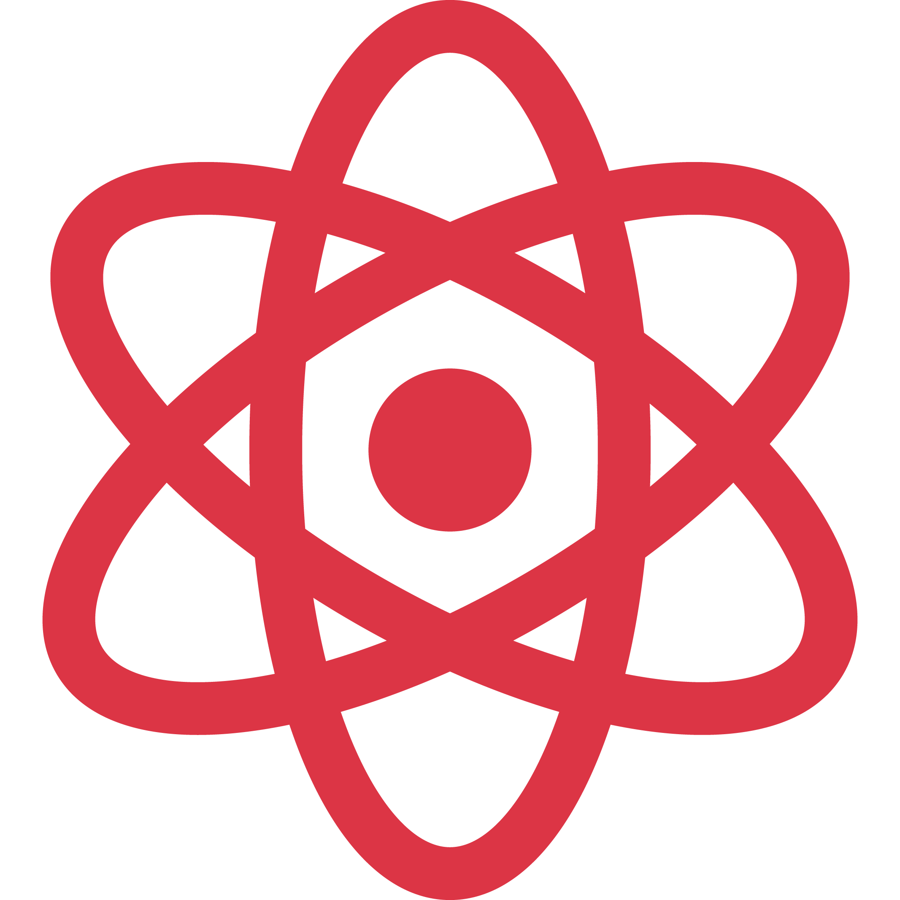
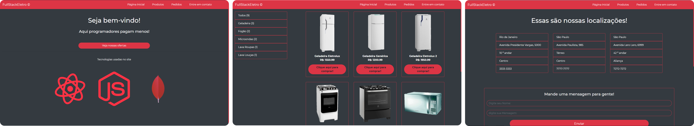

<h1 align='center'> Full Stack Eletro </h1>

 

<h2 align="center">🖥️ Versão Web 🖥️</h2>

<h2 align="center">📱 Versão Web Responsivo: 📱</h2>

<h2 style="font-weight: 600">📜 Sobre o projeto:</h2>

O <b>Full Stack Eletro</b> foi criado durante o curso de <b>desenvolvimento Full-Stack</b> da Recodepro com intuíto de aprendizado de funcionalidades das tecnologias e também como portfólio.
O projeto simula um E-Commerce, porém, note que algumas funcionalidades como cadastramento ou login não são aplicadas, assim como o carrinho.

<h2 style="font-weight: 600">⚙️ Tecnologias aplicadas:</h2> 
<ul>
<li>Node.JS (Backend)</li>
<li>React.JS (Front-end)</li>
<li>MySQL (Banco de dados relacional)</li>
<li>NoSQL (Banco de dados não relacional)</li>
<li>Server Side Rendering (SSR)</li>
<li>CSS</li>
<li>Bootstrap (sistema de grid e de cores)</li>
</ul>

<h1 style="font-weight: 600" align="center">🚀 Como rodar o projeto 🚀</h1>

1. Clone o projeto
2. Primeiro vamos ao diretório **backend**
3. Execute a instalação dos módulos necessários com o comando ***npm install***
4. Feito isso use ***npm start*** e o servidor backe-end irá iniciar com nodemon rodando na porta **4000**
5. Voltando para o diretório anterior, abra outro terminal e vá agora no diretório **frontend**
6. Faremos o mesmo processo de instalação de modulos e inicialização de servidores (***npm install e npm start***) e o servidor irá iniciar na porta **3000**
7. Feito isso a sua aplicação estará rodando normalmente.

- Vale dizer que você precisa importar os arquivos de banco de dados para seu MySQL, o arquivo **db.sql** dentro de **backend** tem o conteúdo necessário
- E mantenha também o **NoSQL** ativo.
